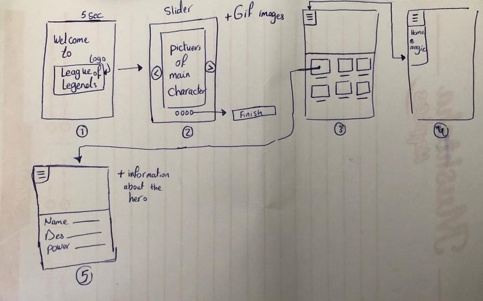
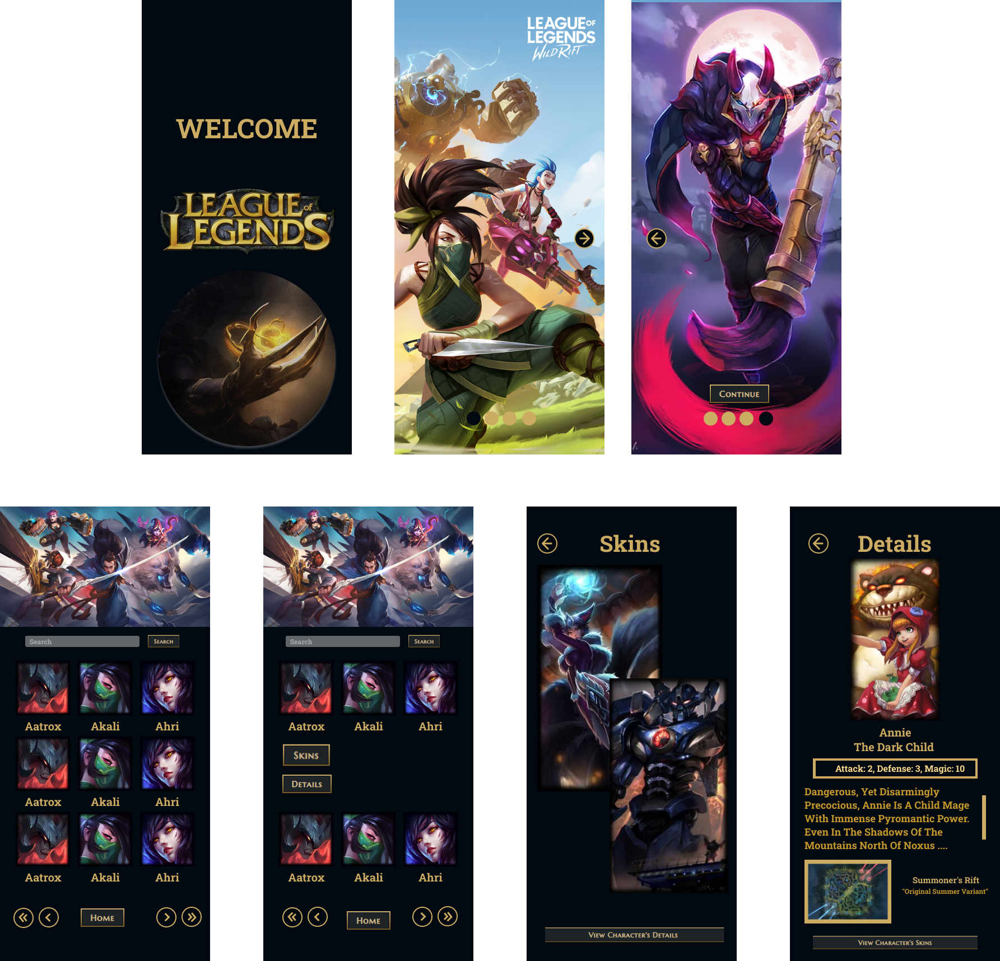
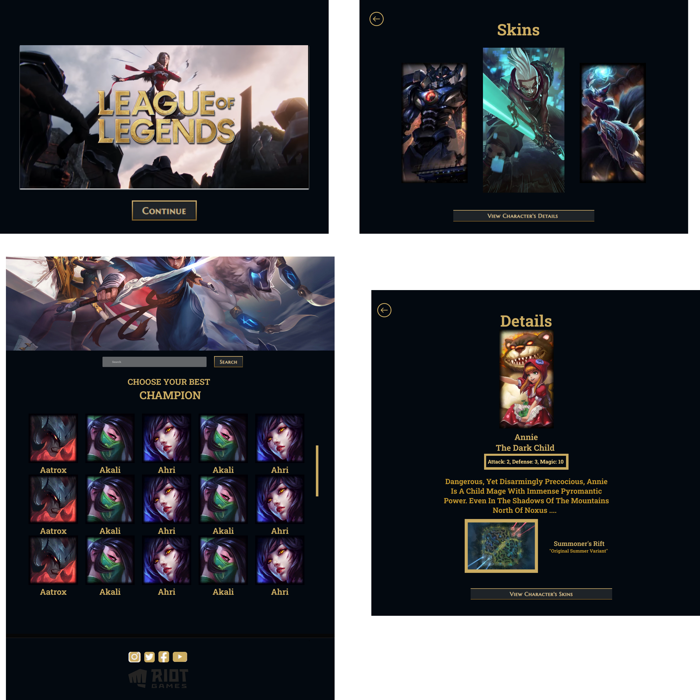

# Team10-League-of-Legends

- [Wireframe](#wireFrame)
- [Design](#design)
- [Description](#description)
- [Build with](#buildWith)
- [Features](#features)
- [User journey](#userJourney)
- [User stories](#userStories)
- [Links](#links)
- [Mentor](#mentor)
- [Team members](#teamMember)
# Wire Frame  

# Design  
## Mobile 

## Desktop 

# Description  
Our website is the perfect website for League of Legends players, it provides them with information about League of Legends's champions and displays its available skins

## Features  
- Animation
- API
- Responsive 
- Simple UI
# Build with  
- HTML
- CSS
- JavaScript
- Local Storage

# User Journey  
**First** when the user enter the website landing page will show up for 4 seconds then it will disappear.

**Second** Slider page that contains images of league of legends champions at the end a continue button will show up that will move you to the Home page.

**Third** in the home page there is a search bar that enables you to search for any champions you want. when you click on a champion image two buttons will appear that will lead you to skin page or details page.

**Fourth** in the skins page he will be able to see the champion's skins and in the details page he will be able to see some information about the champion and see the champion's map. and you can move between the skins and details pages directly.

## User Stories  
* as a user i should be able to search about any character
* as a user i should be able to see the skins of the champion. 
* as a user i should be able to see the details of the character. 

## Link  
- You can visit our Website by [Clicking here](https://gsg-cf05.github.io/Team10-League-of-Legends/)
- API documentation [Charcter information](http://ddragon.leagueoflegends.com/cdn/12.5.1/data/en_US/champion.json) and 
[Map information](http://ddragon.leagueoflegends.com/cdn/6.8.1/data/en_US/map.json)
## How do I get the project on my local machine?
### You can get the project in your local machine:-

- git clone `https://github.com/GSG-CF05/Team10-League-of-Legends.git`

- cd Team10-League-of-Legends
- go live server

## Mentor  
- [Yousef Dalloul](https://github.com/Yousef-Dall)
## Team members:  
- [Bakeza Diazada](https://github.com/Bakeza)
- [Husam Al-Tahrawi](https://github.com/htahrawi)
- [Mohammed Al-Shorafa](https://github.com/mohmmed23)
- [Mohammed Sallout](https://github.com/MzSalout)